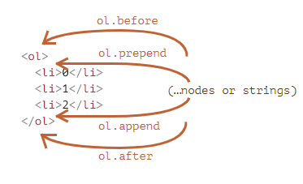

# Week 3 Day 4 Lecture

# Modifying the document

DOM modification is the key to creating “live” pages.

Today we’ll create new elements “on the fly” and modify the existing page content.

## Creating an element

To create DOM nodes, there are two methods:

document.createElement(tag)

Creates a new element node with the given tag:

```js
var div = document.createElement("div");
document.createTextNode(text);
```

Creates a new text node with the given text:

```js
var textNode = document.createTextNode("Here I am");
```

Most of the time we need to create element nodes (using tags), such as the li or div.

Using an example of an error message:

Creating the message div takes 3 steps:

```js
// 1. Create <div> element
let div = document.createElement("div");

// 2. Set its class to "error"
div.className = "error";

// 3. Fill it with the content
div.innerHTML =
  "<p>Invalid <strong>email address.</strong> Please try again.</p>";
```

We’ve created the element, but as of now it’s only being stored as a variable named "div" inside of our JavaScript code.  The element has not been added to the page yet, so we can’t see it.

## Insertion methods

To make the div appear on the page, we need to insert it somewhere into the HTML document. For instance, into `<body>` element, referenced by `document.body`.

There’s a special method, `append`, for that:
`document.body.append(div)`.

```html
<style>
  .error {
    padding: 15px;
    border: 1px solid #d6e9c6;
    border-radius: 4px;
    color: red;
    background-color: #dff0d8;
  }
</style>

<script>
  let div = document.createElement("div");
  div.className = "error";
  div.innerHTML =
    "<p>Invalid <strong>email address.</strong> Please try again.</p>";

  document.body.append(div);
</script>
```

NOTE: We can also directly assign a class (since it is an attribute), however in JavaScript the word 'class' is a special keyword, so we use the attribute of `className`.

Here we called `append` on document.body, but we can call the append method on any other element, to add another element onto it.

For instance, we can append something to `<div>` by calling `div.append(anotherElement)`.

Here are more insertion methods which specify different places to insert an HTML element:

- `node.append(...nodes or strings)` – Append nodes or strings at the end of the node,
- `node.prepend(...nodes or strings)` – Insert nodes or strings at the beginning of the node,
- `node.before(...nodes or strings)` –- Insert nodes or strings before the node,
- `node.after(...nodes or strings)` –- Insert nodes or strings after the node,
- `node.replaceWith(...nodes or strings)` –- Replaces a node with the given nodes or strings.

Here’s an example of these methods being used to add items to a list as well as the text before/after it:

```html
<ol id="ol">
  <li>0</li>
  <li>1</li>
  <li>2</li>
</ol>

<script>
  var ol = document.getElementById("ol");
  ol.before("before"); // insert string "before" before <ol>
  ol.after("after"); // insert string "after" after <ol>

  let liFirst = document.createElement("li");
  liFirst.innerHTML = "prepend";
  ol.prepend(liFirst); // insert liFirst at the beginning of <ol>

  let liLast = document.createElement("li");
  liLast.innerHTML = "append";
  ol.append(liLast); // insert liLast at the end of <ol>
</script>
```

before

<ol id="ol">
  <li>Prepend</li>
  <li>0</li>
  <li>1</li>
  <li>2</li>
  <li>Append</li>
</ol>
after

Here’s a visual picture of what the methods do:

!

So the final list will be:

```html
before
<ol id="ol">
  <li>Prepend</li>
  <li>0</li>
  <li>1</li>
  <li>2</li>
  <li>Append</li>
</ol>
after
```

## BREAKING DOWN THE DEMO

## PRACTICE

TO DO APP

1. EASY: First write out a function that will add on to the existing list from the user's input.
2. EASY: Create a `<button>` at the bottom of the list which will clear out the entire list.
3. HARD: With each item that is added, also add a delete button. NOTE: We will need a running count to keep track of which id/element to delete.
4. NIGHTMARE: Using the running count, can you figure out a way to edit each task? NOTE: We will need to add an 'Edit' `<button>`.

## EXERCISE

Populate a contact list from the form inside of the footer you created yesterday.

## RETROSPECTIVE
